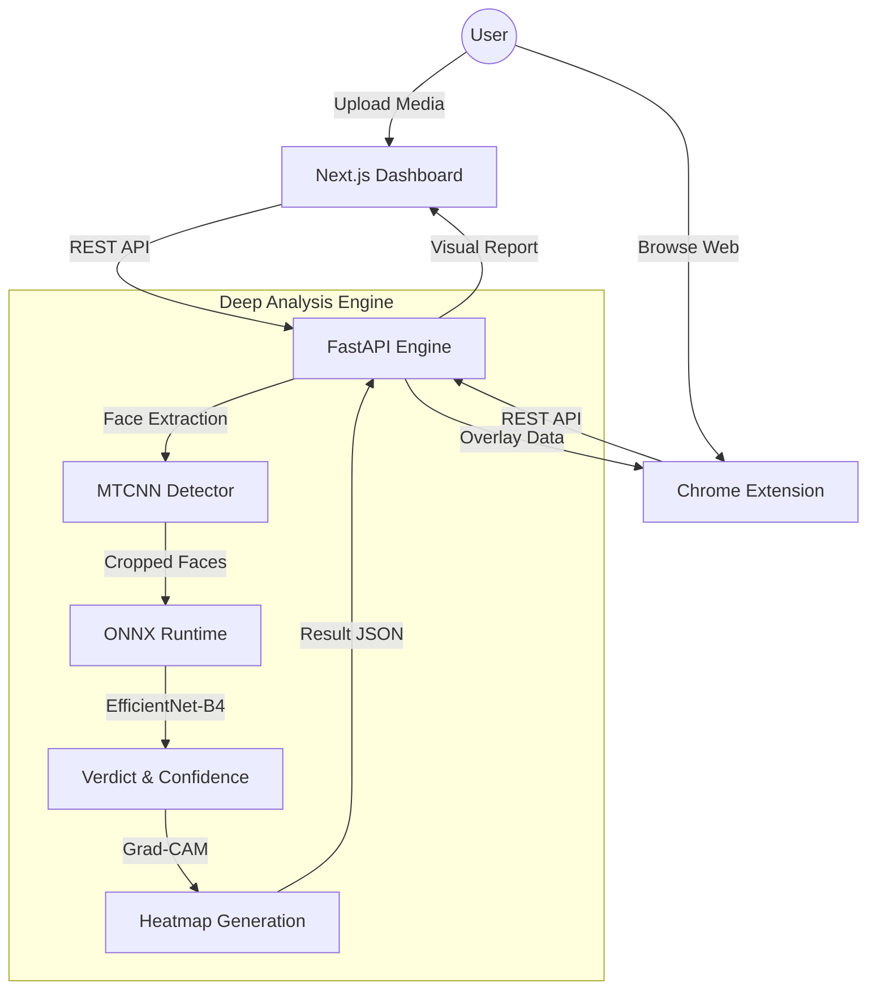

# 🛡️ DeepFake Forensic System (DFFS)

<p align="center">
  
</p>

<p align="center">
  
  
  
  
</p>

---

**DeepFake Forensic System (DFFS)** is a production-grade, end-to-end cybersecurity solution designed to identify AI-generated manipulations in images and videos. Utilizing state-of-the-art **EfficientNet-B4** architectures and **Grad-CAM explainability**, it provides high-accuracy detection coupled with visual forensic evidence.

## ✨ Core Features

- 🔍 **Advanced Image Analysis**: Detect manipulations in JPEG, PNG, and WebP with high precision.
- 🎬 **Temporal Video Scanning**: Frame-by-frame analysis of MP4, AVI, and MOV files to identify temporal inconsistencies.
- 🧠 **Explainable AI (XAI)**: Visual Grad-CAM heatmaps highlight manipulated facial regions for human verification.
- 🌐 **Chrome Extension**: Real-time detection on any webpage with right-click "Detect" and auto-scan capabilities.
- 📊 **Forensic Dashboard**: Beautifully designed Next.js dashboard with history, stats, and detailed reports.
- 🔒 **Privacy First**: All processing is done in-memory; your media is never stored on our servers.

## 🏗️ System Architecture



## 🛠️ Technical Stack

| Component | Technology | Description |
| :--- | :--- | :--- |
| **Frontend** | `Next.js 15`, `Tailwind 4`, `Framer Motion` | Modern, responsive forensic interface. |
| **Backend** | `FastAPI`, `ONNX Runtime`, `OpenCV` | High-performance inference gateway. |
| **Extension** | `Chrome Manifest V3`, `Vanilla JS` | Real-time web-integrated protection. |
| **ML Engine** | `EfficientNet-B4`, `PyTorch`, `MTCNN` | SOTA deepfake detection backbone. |

## 🚀 Quick Start

### 📋 Prerequisites
- **Node.js 18+** & `pnpm`
- **Python 3.9+**
- **CUDA-enabled GPU** (Recommended for video analysis)

### 1️⃣ Backend Setup
```bash
cd backend
pip install -r requirements.txt
python scripts/download_models.py
uvicorn app.main:app --host 0.0.0.0 --port 8000 --reload
```

### 2️⃣ Frontend Setup
```bash
cd frontend
pnpm install
pnpm dev
```

### 3️⃣ Chrome Extension Setup
1. Open Chrome and navigate to `chrome://extensions/`
2. Enable **Developer mode** (top right)
3. Click **Load unpacked** and select the `chrome-extension` folder.

---

## 📂 Project Structure

- **[`backend`](./backend)**: FastAPI service handling ML inference and API requests.
- **[`frontend`](./frontend)**: Next.js dashboard for user interactions and reports.
- **[`chrome-extension`](./chrome-extension)**: Browser extension for on-the-go detection.
- **[`ml`](./ml)**: Machine learning pipeline, training scripts, and model exports.

## 🤝 Contributing

We welcome contributions! Please see our [Contributing Guide](CONTRIBUTING.md) (coming soon) for more details.

## ⚖️ License

Distributed under the MIT License. See `LICENSE` for more information.

<p align="right">(<a href="#top">back to top</a>)</p>
