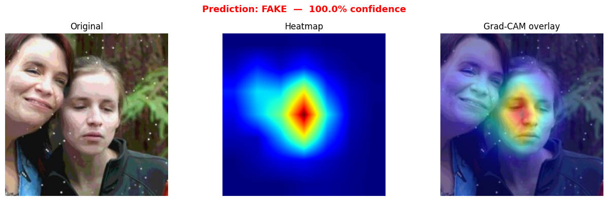
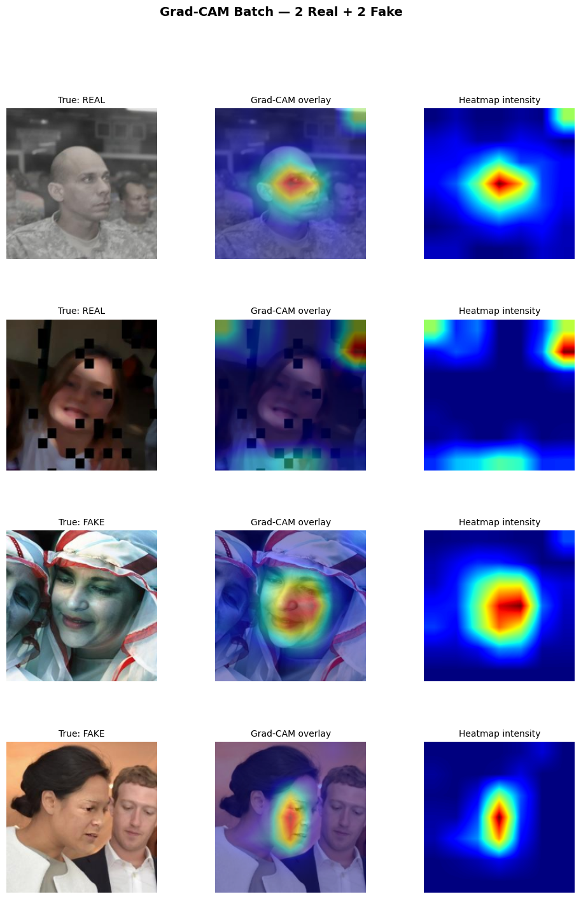

<div align="center">

# DFFS ML Engine
### Deep Learning Training Pipeline

[](https://pytorch.org)
[](https://onnx.ai)
[](https://github.com/huggingface/pytorch-image-models)
[](https://albumentations.ai)

</div>

---

## Overview

This directory contains the complete training, evaluation, and export pipeline for the DFFS deepfake detection model. The model is an **EfficientNet-B4** fine-tuned on a balanced dataset of real and GAN-generated face images. After training, it is exported to ONNX for CPU-optimized inference in the backend.

---

## Results

<div align="center">
<table>
<tr>
<td align="center" width="50%">

<br/><em>Image Detection — Verdict + Grad-CAM</em>
</td>
<td align="center" width="50%">

<br/><em>Batch Grad-CAM — Multi-image Grid</em>
</td>
</tr>
</table>
</div>

<br/>

<div align="center">
<table>
<tr>
<td align="center" width="50%">

<br/><em>Confusion Matrix on Validation Set</em>
</td>
<td align="center" width="50%">

<br/><em>ROC Curve — AUC Score</em>
</td>
</tr>
</table>
</div>

<br/>

<div align="center">

<br/><em>Dataset Distribution — Stage 1 Setup</em>
</div>

<br/>

<div align="center">
<table>
<tr>
<td align="center" width="50%">

<br/><em>Grad-CAM — Single Image Explanation</em>
</td>
<td align="center" width="50%">

<br/><em>Grad-CAM — Batch Explanation Grid</em>
</td>
</tr>
</table>
</div>

---

## Project Structure

```
ml/
├── src/
│   ├── model.py          # EfficientNet-B4 architecture definition
│   ├── dataset.py        # PyTorch Dataset — loads real/fake image folders
│   ├── transforms.py     # Albumentations train/val augmentation pipelines
│   ├── train.py          # Training loop — AdamW + CosineAnnealingLR + early stopping
│   ├── evaluate.py       # Evaluation — confusion matrix, ROC curve, classification report
│   ├── gradcam.py        # Grad-CAM heatmap generation and visualization
│   ├── split.py          # Splits raw dataset into train/val folders
│   └── utils.py          # Seed fixing, device detection, checkpoint save/load
│
├── notebooks/
│   ├── stage1_setup.ipynb    # Dataset exploration and environment setup
│   ├── split_data.ipynb      # Interactive data splitting
│   └── stage2_train.ipynb    # Full training run with live loss/accuracy plots
│
├── data/
│   ├── raw/
│   │   ├── real/             # Raw real face images
│   │   └── fake/             # Raw GAN-generated face images
│   └── split/
│       ├── train/
│       │   ├── real/
│       │   └── fake/
│       └── val/
│           ├── real/
│           └── fake/
│
├── checkpoints/
│   └── best_model.pth        # Best checkpoint saved during training
│
├── exports/
│   ├── deepfake_detector.onnx       # ONNX model for production inference
│   └── deepfake_detector.onnx.data  # External data file for large ONNX model
│
└── output/
    ├── confusion_matrix.png          # Saved confusion matrix plot
    ├── roc_curve.png                 # Saved ROC curve plot
    └── gradcam/
        ├── gradcam_single.png        # Single image Grad-CAM output
        ├── gradcam_batch.png         # Batch Grad-CAM grid
        ├── real_0_heatmap.png        # Raw heatmap for a real sample
        └── real_0_overlay.png        # Overlay for a real sample
```

---

## Model Architecture

```
DeepfakeDetector
  └── EfficientNet-B4 backbone (pretrained ImageNet, global_pool=avg)
        └── output: (B, 1792)
  └── Classification Head
        ├── Dropout(0.3)
        ├── Linear(1792 → 256)
        ├── ReLU()
        ├── Dropout(0.15)
        └── Linear(256 → 2)   ← logits: [real, fake]
```

| Property | Value |
|----------|-------|
| Input size | 224 × 224 × 3 |
| Output | 2-class logits (real=0, fake=1) |
| Backbone params | ~17.5M |
| Total trainable params | ~17.9M |
| Inference format | ONNX (CPU-optimized) |

---

## Training Pipeline (`src/train.py`)

| Setting | Value |
|---------|-------|
| Optimizer | AdamW (lr=3e-4, weight_decay=1e-4) |
| Scheduler | CosineAnnealingLR (T_max=epochs, eta_min=1e-6) |
| Loss | CrossEntropyLoss |
| Batch size | 16 |
| Max epochs | 10 |
| Early stopping | patience=3 (val accuracy) |
| Gradient clipping | max_norm=1.0 |
| Device | CUDA if available, else CPU |

The best checkpoint is saved to `checkpoints/best_model.pth` whenever validation accuracy improves.

---

## Augmentation Pipeline (`src/transforms.py`)

### Training
```python
A.Resize(224, 224)
A.HorizontalFlip(p=0.5)
A.Rotate(limit=15, p=0.5)
A.RandomBrightnessContrast(p=0.4)
A.GaussNoise(p=0.2)
A.Normalize(mean=[0.485, 0.456, 0.406], std=[0.229, 0.224, 0.225])
ToTensorV2()
```

### Validation
```python
A.Resize(224, 224)
A.Normalize(mean=[0.485, 0.456, 0.406], std=[0.229, 0.224, 0.225])
ToTensorV2()
```

---

## Dataset (`src/dataset.py`)

`DeepfakeDataset` expects this folder structure:

```
split/
  train/
    real/   ← label 0
    fake/   ← label 1
  val/
    real/
    fake/
```

Supported formats: `.jpg`, `.jpeg`, `.png`, `.webp`

Images are loaded with OpenCV (BGR → RGB), then passed through the Albumentations transform pipeline.

---

## Grad-CAM (`src/gradcam.py`)

Grad-CAM hooks into the **last convolutional block** of EfficientNet-B4 (`model.backbone.blocks[-1]`) to capture activations and gradients.

```
Forward pass → save activations
Backward pass on target class logit → save gradients
Global average pool gradients → weights (C,)
Weighted sum of activation maps → CAM (H, W)
ReLU → upsample to 224×224 → normalize [0, 1]
Apply COLORMAP_JET → blend with original image
```

Two visualization modes:
- `explain_single(image_path)` — shows original | heatmap | overlay for one image
- `explain_batch(image_paths)` — generates a grid for multiple images

Outputs are saved to `output/gradcam/`.

---

## Step-by-Step Usage

### 1. Install Dependencies

```bash
pip install torch torchvision timm albumentations opencv-python-headless \
            scikit-learn matplotlib seaborn onnx onnxruntime
```

### 2. Prepare Dataset

Place your raw images in:
```
ml/data/raw/real/   ← real face images
ml/data/raw/fake/   ← GAN-generated face images
```

Then split into train/val (80/20):

```bash
python src/split.py
```

### 3. Train

```bash
python src/train.py
```

Checkpoints are saved to `checkpoints/best_model.pth` automatically.

### 4. Evaluate

```bash
python src/evaluate.py
```

Outputs confusion matrix and ROC curve to `output/`.

### 5. Generate Grad-CAM Explanations

```bash
python src/gradcam.py
```

Outputs heatmap visualizations to `output/gradcam/`.

### 6. Export to ONNX

Run the export notebook or use the script below:

```python
import torch
from src.model import build_model

model = build_model(pretrained=False)
ckpt  = torch.load("checkpoints/best_model.pth", map_location="cpu")
model.load_state_dict(ckpt["model_state"])
model.eval()

dummy = torch.randn(1, 3, 224, 224)
torch.onnx.export(
    model, dummy,
    "exports/deepfake_detector.onnx",
    input_names=["input"],
    output_names=["output"],
    dynamic_axes={"input": {0: "batch_size"}},
    opset_version=17,
)
print("Exported to exports/deepfake_detector.onnx")
```

---

## Notebooks

| Notebook | Purpose |
|----------|---------|
| `stage1_setup.ipynb` | Dataset exploration, class distribution, sample visualization |
| `split_data.ipynb` | Interactive train/val split with statistics |
| `stage2_train.ipynb` | Full training run with live loss/accuracy plots and checkpoint saving |

---

## Checkpoint Format

```python
{
    "epoch":       int,          # epoch when this checkpoint was saved
    "model_state": OrderedDict,  # model.state_dict()
    "val_acc":     float,        # validation accuracy at this epoch
    "val_loss":    float,        # validation loss at this epoch
}
```

Load with:
```python
ckpt = torch.load("checkpoints/best_model.pth", map_location="cpu")
model.load_state_dict(ckpt["model_state"])
```

---

<div align="center">

DFFS — DeepFake Forensic System · ML Module

<br/>

Developed by [Vighnesh Salunkhe](https://github.com/vighneshsalunkhe)

</div>
